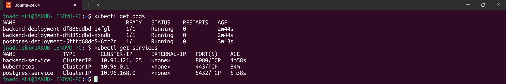
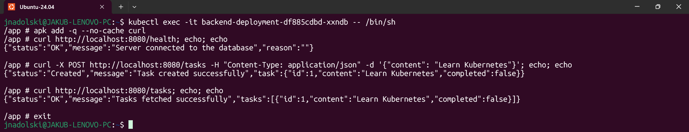
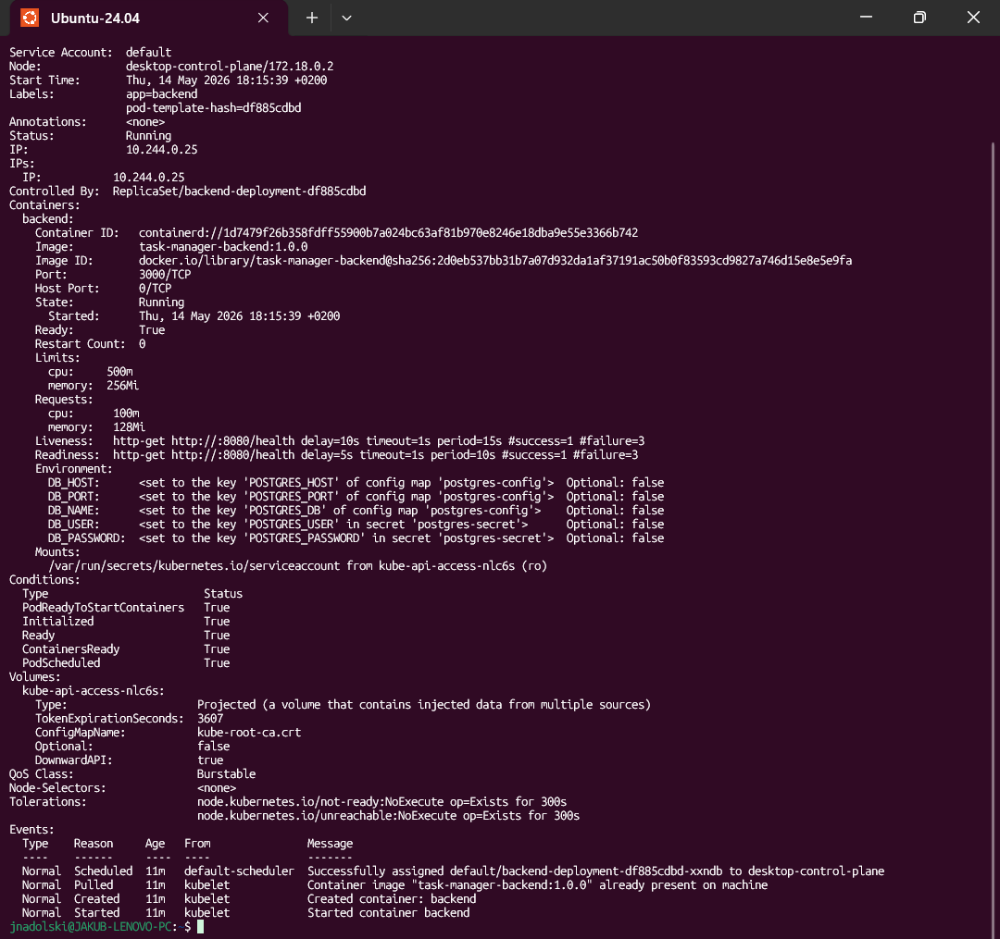

# Laboratorium 11

---

## Treść zadania
Dziś napiszemy pierwszą wersję backendu **Task Managera** i wdrożymy go w klastrze Kubernetes razem z bazą danych
PostgreSQL. System będziemy rozwijać przez kolejne zajęcia.
Na tych zajęciach celowo **nie dodajemy trwałego wolumenu** dla bazy danych. Zapamiętaj, co się dzieje z danymi, gdy
zrestartujesz Poda bazy — wrócimy do tego na kolejnych zajęciach.

### Krok 1 — Repozytorium i struktura katalogów
Utwórz nowe repozytorium na GitHubie lub GitLabie, sklonuj je lokalnie i stwórz strukturę katalogów:
```text
|___ app/
|    |___ backend/
|         |___ Dockerfile
|         |___ src/
|___ k8s/
|    |___ postgres/
|    |    |___ deployment.yaml
|    |    |___ service.yaml
|    |    |___ configmap.yaml
|    |    |___ secret.yaml
|    |___ backend/
|         |___ deployment.yaml
|         |___ service.yaml
|___ .github/
     |___ workflows/           <-- wypełnimy na kolejnych zajęciach
```
Katalog `k8s/` zawiera wyłącznie manifesty Kubernetes — żadnego kodu aplikacji. Katalog `app/` zawiera kod i Dockerfile
— żadnych plików k8s. To rozdzielenie będzie ważne, gdy zaczniemy budować pipeline CI/CD.

### Krok 2 — Napisz backend Task Managera
W katalogu `app/backend/` zaimplementuj serwis HTTP w wybranej technologii (Node.js, Java, .NET lub Go) z następującymi
endpointami:

| Metoda | Endpoint     | Opis                                      |
|--------|--------------|-------------------------------------------|
| GET    | `/tasks`     | Zwraca listę wszystkich zadań             |
| POST   | `/tasks`     | Tworzy nowe zadanie                       |
| PATCH  | `/tasks/:id` | Aktualizuje status zadania                |
| DELETE | `/tasks/:id` | Usuwa zadanie                             |
| GET    | `/health`    | Zwraca stan aplikacji i połączenia z bazą |

Endpoint `/health` musi zwracać kod `200`, gdy aplikacja działa poprawnie i ma połączenie z bazą, oraz kod `503`, gdy
połączenie z bazą jest niedostępne. Przykładowa odpowiedź:
```json
{
  "status": "ok",
  "database": "connected"
}
```

Aplikacja musi odczytywać konfigurację bazy danych ze zmiennych środowiskowych:
- `DB_HOST` — adres hosta bazy
- `DB_PORT` — port bazy
- `DB_NAME` — nazwa bazy
- `DB_USER` — użytkownik bazy
- `DB_PASSWORD` — hasło

Utwórz `Dockerfile` dla swojej aplikacji. Obraz produkcyjny nie powinien zawierać narzędzi deweloperskich.

### Krok 3 — Zbuduj obraz i załaduj do klastra
Zbuduj obraz lokalnie i załaduj go do swojego klastra. Nie publikujemy jeszcze do żadnego rejestru.

### Krok 4 — Stworzenie ConfigMap, Secret i plików Deployment

### Krok 5 — Uruchom system i zweryfikuj
**W odpowiedzi należy przesłać:**
- Link do repozytorium GitHub.
- Output komendy `kubectl get pods` — wszystkie Pody w statusie `Running`.
- Output komendy `kubectl get services`.
- Wynik `curl http://localhost:8080/health` potwierdzający połączenie z bazą.
- Wynik `curl -X POST /tasks` oraz `curl GET /tasks` potwierdzający działanie API.
- Output `kubectl describe pod <nazwa-poda-backend>` — sekcje `Limits`, `Requests`, `Liveness` i `Readiness`.

**Kryteria recenzji:**
- **Jakość treści (60%)**  
  Czy odpowiedź jest kompletna i poprawna
- **Styl pisania (40%)**  
  Czy odpowiedź jest jasna i dobrze napisana

---

## Rozwiązanie zadania
### Wyniki komend `kubectl get pods` i `kubectl get services`


### Wyniki zapytań `curl GET /health`, `curl -X POST /tasks` i `curl GET /tasks`


### Wynik komendy `kubectl describe pod <nazwa-poda-backend>`

