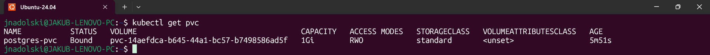
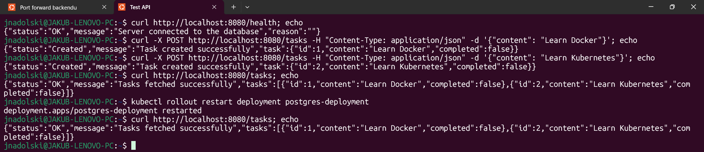
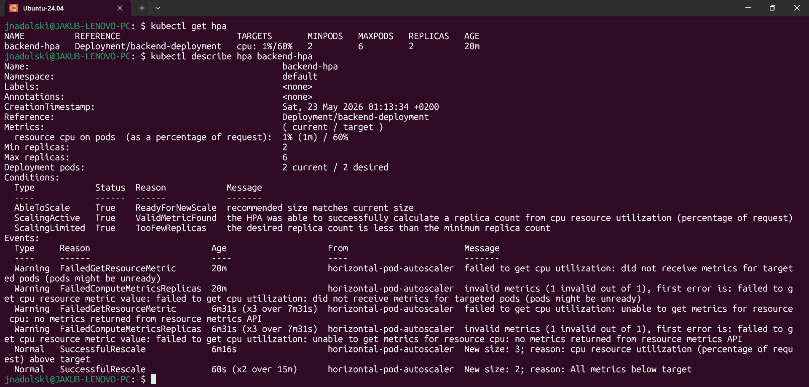

# Laboratorium 12

---

## Treść zadania
Kontynuujemy nasz projekt z zeszłego tygodnia — backend Task Managera, połączony z bazą danych PostgreSQL. Dodamy trwały
wolumen danych, autoskalowanie backendu i zautomatyzujemy wdrożenie za pomocą pierwszego pipeline'u CI/CD.

### Krok 1 — Trwałość danych bazy (PVC)
Zaktualizuj strukturę repozytorium — dodaj plik `pvc.yaml` w katalogu `k8s/postgres/`:
```text
k8s/
|___ postgres/
     |___ configmap.yaml
     |___ deployment.yaml
     |___ pvc.yaml          <- nowy plik
     |___ secret.yaml
     |___ service.yaml
```

Utwórz plik `k8s/postgres/pvc.yaml`:
```yaml
apiVersion: v1
kind: PersistentVolumeClaim
metadata:
  name: postgres-pvc
spec:
  accessModes:
    - ReadWriteOnce
  resources:
    requests:
      storage: 1Gi
```

Zaktualizuj `k8s/postgres/deployment.yaml` — podmontuj wolumen do kontenera bazy. Zastosuj zmiany i zweryfikuj, że PVC
zostało przydzielone:
```shell
kubectl get pvc
kubectl get pods -w
```

Sprawdź trwałość danych:
- dodaj kilka zadań przez API
- zrestartuj Pod bazy
```shell
kubectl delete <nazwa-poda-backend>
kubectl get pods
```
Sprawdź, czy dane nadal istnieją.

### Krok 2 — Autoskalowanie backendu (HPA)
Zaktualizuj strukturę repozytorium — dodaj plik `hpa.yaml` w katalogu `k8s/backend/`:
```text
k8s/
|___ backend/
     |___ deployment.yaml
     |___ hpa.yaml          <- nowy plik
     |___ service.yaml
```

Zainstaluj Metrics Server w klastrze — wymagany przez HPA do odczytu metryk CPU. Utwórz plik `k8s/backend/hpa.yaml`.
Zastosuj i sprawdź stan HPA:
```shell
kubectl apply -f k8s/backend/hpa.yaml
kubectl get hpa
kubectl describe hpa backend-hpa
```
Kolumna **TARGETS** może przez chwilę pokazywać `<unknown>` — poczekaj minutę aż Metrics Server zbierze pierwsze dane.

### Krok 3 — Pierwszy pipeline CI/CD
Zaktualizuj strukturę repozytorium:
```text
.github/
|___ workflows/
     |___ ci.yaml           <- nowy plik
```

Utwórz plik `.github/workflows/ci.yaml`:
```yaml
name: CI

on:
  push:
    branches: [main]

jobs:
  build-and-test:
    runs-on: ubuntu-latest
    steps:
      - name: Checkout
        uses: actions/checkout@v4
      - name: Zaloguj do ghcr.io
        uses: docker/login-action@v3
        with:
          registry: ghcr.io
          username: ${{ github.actor }}
          password: ${{ secrets.GITHUB_TOKEN }}
      - name: Zbuduj i opublikuj obraz
        uses: docker/build-push-action@v5
        with:
          context: ./app/backend
          push: true
          tags: ghcr.io/${{ github.repository }}/backend:${{ github.sha }}
      - name: Uruchom klaster kind
        uses: helm/kind-action@v1
        with:
          cluster_name: test-cluster
      - name: Załaduj obraz do kind
        run: |
          docker pull ghcr.io/${{ github.repository }}/backend:${{ github.sha }}
          kind load docker-image \
            ghcr.io/${{ github.repository }}/backend:${{ github.sha }} \
            --name test-cluster
      - name: Wdróż system
        run: |
          kubectl apply -f k8s/postgres/
          kubectl apply -f k8s/backend/
          kubectl set image deployment/backend \
            backend=ghcr.io/${{ github.repository }}/backend:${{ github.sha }}
      - name: Poczekaj na gotowość Podów
        run: |
          kubectl rollout status deployment/postgres --timeout=120s
          kubectl rollout status deployment/backend --timeout=120s
      - name: Test HTTP
        run: |
          kubectl port-forward service/backend-service 8080:8080 &
          sleep 5
          curl --fail http://localhost:8080/health
```
Upewnij się, że repozytorium jest publiczne lub że pakiety `ghcr.io` mają ustawioną widoczność publiczną:  
**Settings** -> **Packages** -> **Change visibility** -> **Public**  
Wgraj zmiany do repozytorium i obserwuj pipeline:
```shell
git add .
git commit -m "feat: PVC, HPA i pierwszy pipeline CI/CD"
git push
```
Przejdź do zakładki **Actions** w swoim repozytorium na GitHubie i obserwuj wykonanie pipeline'u.

### Krok 4 — Weryfikacja całego systemu
Sprawdź stan wszystkich zasobów.
```shell
kubectl get pods
kubectl get pvc
kubectl get hpa
kubectl get services

# Uruchom port-forward i przetestuj API
kubectl port-forward service/backend-service 8080:8080
curl http://localhost:8080/health
curl http://localhost:8080/tasks
```

### W odpowiedzi należy przesłać
1. Link do repozytorium GitHub z plikami z tego ćwiczenia.
2. Output komendy `kubectl get pvc` — PVC w statusie `Bound`.
3. Dowód trwałości danych — output `kubectl get tasks` przed i po restarcie Poda bazy.
4. Output komendy `kubectl get hpa` oraz `kubectl describe hpa backend-hpa`.
5. Link do zakończonego pipeline'u w zakładce Actions na GitHubie.
6. Zrzut ekranu lub output potwierdzający przejście kroku testowego (`curl /health`) w pipeline.

### Kryteria recenzji
- **Trwałość danych — PVC (30%)**  
  Plik `pvc.yaml` definiuje PVC z trybem dostępu `ReadWriteOnce` i minimalną przestrzenią 1Gi. Deployment PostgreSQL
  montuje wolumen w `/var/lib/postgresql/data`. Output `kubectl get pvc` pokazuje status `Bound`. Dane dodane przez API
  są widoczne po restarcie Poda bazy.
- **Autoskalowanie — HPA (20%)**  
  Plik `hpa.yaml` definiuje HPA z wartościami `minReplicas`, `maxReplicas` i progiem CPU. HPA wskazuje na Deployment
  backendu. Output `kubectl desribe hpa` pokazuje aktualne metryki w kolumnie `TARGETS`. Deployment backendu ma
  zadeklarowane `resources.requests.cpu`.
- **Pipeline CI/CD (35%)**  
  Plik `ci.yaml` definiuje workflow uruchamiany przy pushu do `main`. Pipeline zawiera kroki: budowanie obrazu, push do
  `ghcr.io`, uruchomienie `kind`, załadowanie obrazu, wdrożenie przez `kubectl apply` i test HTTP. Link do zakończonego
  pipeline'u potwierdza, że wszystkie kroki zakończyły się sukcesem (zielony status).
- **Jakość repozytorium (15%)**  
  Manifesty są podzielone według komponentów w katalogu `k8s/`. Plik Secret nie zawiera hasła w postaci jawnej. Commit
  message opisuje wprowadzone zmiany.

---

## Rozwiązanie zadania
### Wynik komendy `kubectl get pvc`


### Dowód trwałości danych przed i po restarcie Poda bazy danych


### Wynik komend `kubectl get hpa` i `kubectl describe hpa backend-hpa`

