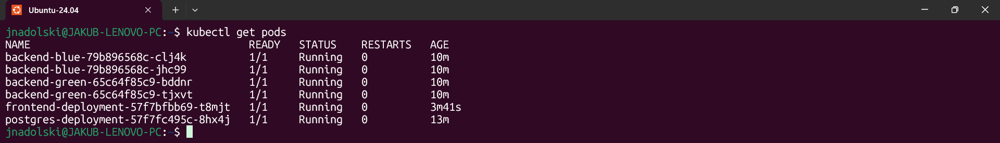
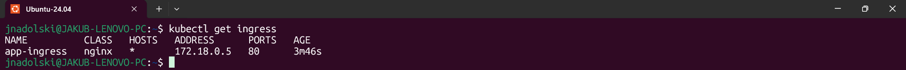
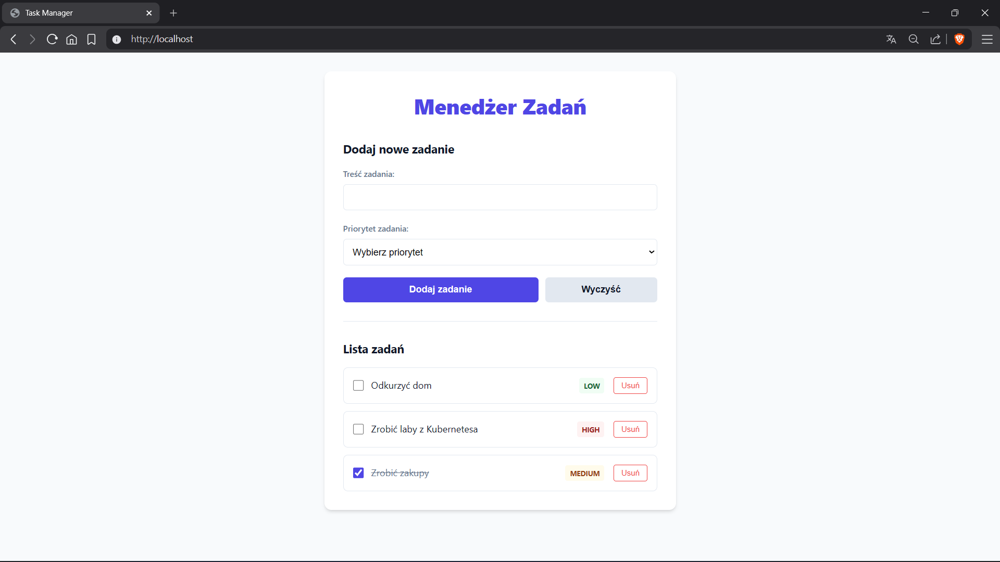
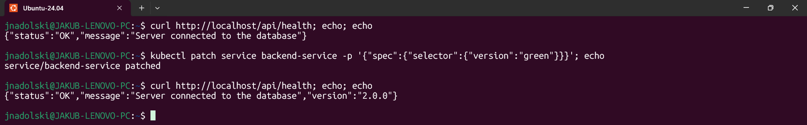

# Laboratorium 13

---

## Treść zadania
Używanie `kubectl port-forward` nie jest stabilnym rozwiązaniem, używamy go tylko w trakcie developmentu naszego systemu.
Dziś dodamy Ingress jako jeden punkt wejścia do całej aplikacji, napiszemy frontend, który komunikuje się z backendem,
a następnie wdrożymy nową wersję backendu bez żadnego przestoju, używając strategii blue-green.

### Krok 1 — Instalacja Nginx Ingress Controller
Zainstaluj nginx Ingress Controller w klastrze:
```shell
kubectl apply -f https://raw.githubusercontent.com/kubernetes/ingress-nginx/main/deploy/static/provider/cloud/deploy.yaml
kubectl get pods -n ingress-nginx -w

# Sprawdź czy Ingress dostał zewnętrzny adres
kubectl get service -n ingress-nginx ingress-nginx-controller
```
Poczekaj, aż Pod `ingress-nginx-controller` osiągnie status `Running`.

### Krok 2 — Zaktualizuj strukturę repozytorium
Dodaj nowe pliki do repozytorium:
```text
./
|___ app/
|    |___ backend/
|    |___ frontend/          <- nowy katalog
|         |___ Dockerfile
|         |___ src/
|___ k8s/
|    |___ backend/
|    |___ frontend/          <- nowy katalog
|    |    |___ deployment.yaml
|    |    |___ service.yaml
|    |___ ingress/           <- nowy katalog
|    |    |___ ingress.yaml
|    |___ postgres/
|___ .github/
     |___ workflows/
          |___ ci.yaml
```

### Krok 3 — Napisz frontend
W katalogu `app/frontend/` zaimplementuj interfejs użytkownika w wybranej technologii. Frontend musi:
- Pobierać listę zadań z backendu przez `GET /api/tasks`.
- Umożliwiać dodanie nowego zadania z wyborem priorytetu przez `POST /api/tasks`.

Frontend komunikuje się z backendem przez względną ścieżkę `/api` — nie przez bezpośredni adres serwisu. Ingress zajmie
się routingiem. Utwórz `Dockerfile` dla frontendu. Dla aplikacji statycznych (plain HTML, React build) możesz użyć
`nginx:alpine` jako serwera plików. Utwórz manifesty Deployment i Service w `k8s/frontend/`.

### Krok 4 — Utwórz Ingress
Utwórz plik `k8s/ingress/ingress.yaml`:
```yaml
apiVersion: networking.k8s.io/v1
kind: Ingress
metadata:
  name: app-ingress
  annotations:
    nginx.ingress.kubernetes.io/rewrite-target: /$2
spec:
  ingressClassName: nginx
  rules:
    - http:
        paths:
          - path: /api(/|$)(.*)
            pathType: ImplementationSpecific
            backend:
              service:
                name: backend-service
                port:
                  number: 8080
          - path: /()(.*)
            pathType: ImplementationSpecific
            backend:
              service:
                name: frontend-service
                port:
                  number: 80
```
Zastosuj wszystkie manifesty i sprawdź, czy system działa:
```shell
kubectl apply -f k8s/postgres/
kubectl apply -f k8s/backend/
kubectl apply -f k8s/frontend/
kubectl apply -f k8s/ingress/

kubectl get pods
kubectl get ingress
```
Otwórz w przeglądarce http://localhost — powinieneś zobaczyć działający frontend. Zweryfikuj routing przez Ingress:
```shell
curl http://localhost/api/health
curl http://localhost/api/tasks
```

### Krok 5 — Blue-green deployment
#### Przygotowanie v2 backendu
W v2 backendu dodaj obsługę pola `priority` (wartości: `low`, `medium`, `high`) do endpointów:
- `POST /tasks` — przyjmuje opcjonalne pole `priority` (domyślnie `medium`).
- `GET /tasks` — zwraca `priority` w każdym zadaniu.
- `GET /health` — zwraca dodatkowo pole `"version": "2.0.0"`.
```shell
kubectl exec -it <nazwa-poda-postgres> -- psql -U appuser -d appdb -c "DROP TABLE IF EXISTS tasks;"
```

#### Deployment blue (aktualna wersja v1)
Zaktualizuj `k8s/backend/deployment.yaml` — dodaj etykietę `version` do Poda i zmień nazwę Deploymentu na `backend-blue`:
```yaml
apiVersion: apps/v1
kind: Deployment
metadata:
  name: backend-blue
spec:
  replicas: 2
  selector:
    matchLabels:
      app: backend
      version: blue
  template:
    metadata:
      labels:
        app: backend
        version: blue
    spec:
      containers:
        - name: backend
          image: ghcr.io/<twoja-nazwa>/<repozytorium>/backend:v1.0.0
          # reszta konfiguracji bez zmian
```
Zaktualizuj `k8s/backend/service.yaml` — Service wskazuje na blue:
```yaml
apiVersion: v1
kind: Service
metadata:
  name: backend-service
spec:
  type: ClusterIP
  selector:
    app: backend
    version: blue
  ports:
    - port: 8080
      targetPort: 8080
```

#### Deployment green (nowa wersja v2)
Utwórz plik `k8s/backend/deployment-green.yaml`:
```yaml
apiVersion: apps/v1
kind: Deployment
metadata:
  name: backend-green
spec:
  replicas: 2
  selector:
    matchLabels:
      app: backend
      version: green
  template:
    metadata:
      labels:
        app: backend
        version: green
    spec:
      containers:
        - name: backend
          image: ghcr.io/<twoja-nazwa>/<repozytorium>/backend:v2.0.0
          # reszta konfiguracji bez zmian
```

#### Wdrożenie i przełączenie ruchu
Zastosuj oba Deploymenty — na razie cały ruch nadal idzie do blue:
```shell
kubectl apply -f k8s/backend/deployment-green.yaml
kubectl get pods
```
Zweryfikuj, że green działa poprawnie, zanim przełączysz ruch:
```shell
# Tymczasowy port-forward bezpośrednio na green
kubectl port-forward deployment/backend-green 8081:8080

curl http://localhost:8081/health
curl http://localhost:8081/tasks
```
Jeśli green działa poprawnie — przełącz ruch:
```shell
kubectl patch service backend-service -p '{"spec":{"selector":{"version":"green"}}}'
```
W razie problemów — natychmiastowy powrót do blue:
```shell
kubectl patch service backend-service -p '{"spec":{"selector":{"version":"blue"}}}'
```
Po potwierdzeniu, że green działa — usuń blue:
```shell
kubectl delete deployment backend-blue
```

### W odpowiedzi należy przesłać
1. Link do repozytorium GitHub.
2. Output komendy `kubectl get pods` — wszystkie Pody w statusie `Running`.
3. Output komendy `kubectl get ingress` potwierdzający adres Ingressu.
4. Zrzut ekranu z działającego frontendu wyświetlającego zadania z priorytetami.
5. Output `curl http://localhost/api/health` dla v1 (przed przełączeniem) i v2 (po przełączeniu).
6. Output `kubectl get pods` podczas blue-green — oba Deploymenty działają jednocześnie.
7. Link do zakończonego pipeline'u w zakładce Actions z tagiem v2.0.0.

### Kryteria recenzji
- **Ingress i routing**  
  Ingress Controller działa w klastrze. Zasób Ingress poprawnie routuje `/api` do backendu i `/` do frontendu. Weryfikacja
  przez `curl http://localhost/api/health` i `curl http://localhost/` kończy się sukcesem bez użycia `port-forward`.
- **Frontend**  
  Frontend wyświetla listę zadań pobraną z backendu przez `/api/tasks`. Każde zadanie pokazuje pole `priority`. Formularz
  dodawania zadania umożliwia wybór priorytetu. Frontend posiada `Dockerfile` i działa jako osobny Deployment z serwisem
  i Readiness Probe.
- **Blue-green deployment**  
  Repozytorium zawiera dwa oddzielne Deploymenty — `backend-blue` i `backend-green` — z etykietą `version`. Serwis backendu
  wskazuje na green po przełączeniu. Output `curl /api/health` potwierdza, że v2 obsługuje ruch (pole `version: 2.0.0`).
  Student opisuje w 3–5 zdaniach jak działa mechanizm przełączenia i dlaczego blue-green eliminuje przestój.

## Rozwiązanie zadania
### Output komendy `kubectl get pods`


### Output komendy `kubectl get ingress`


### Zrzut ekranu z działającego frontendu wyświetlającego zadania z priorytetami


### Output `curl http://localhost/api/health` dla v1 i v2

