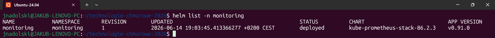
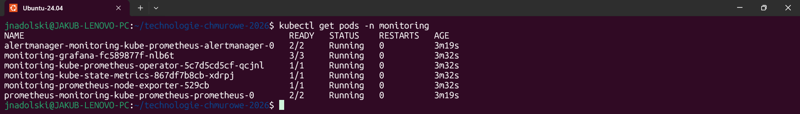
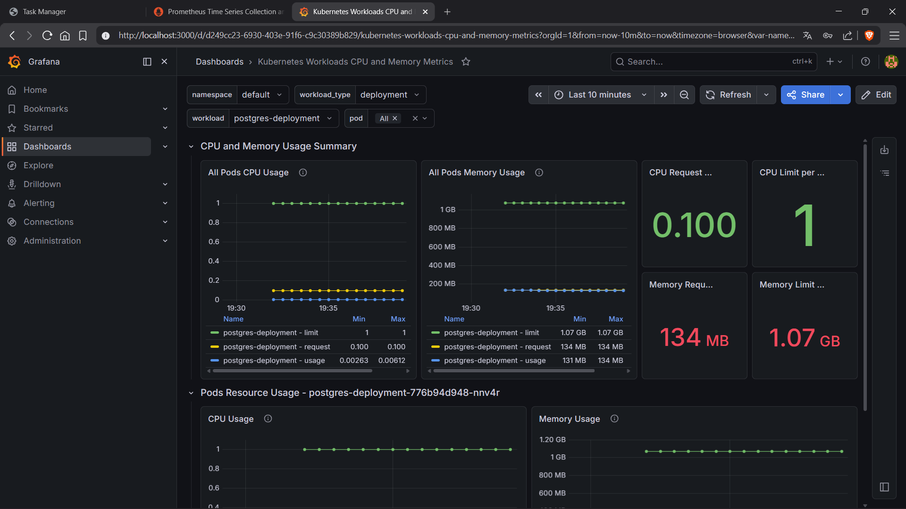
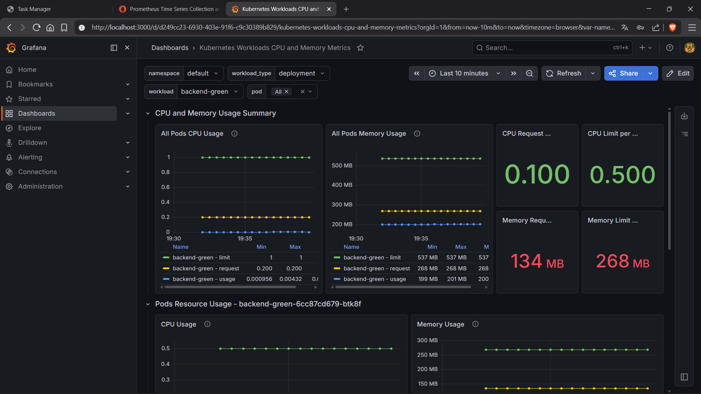
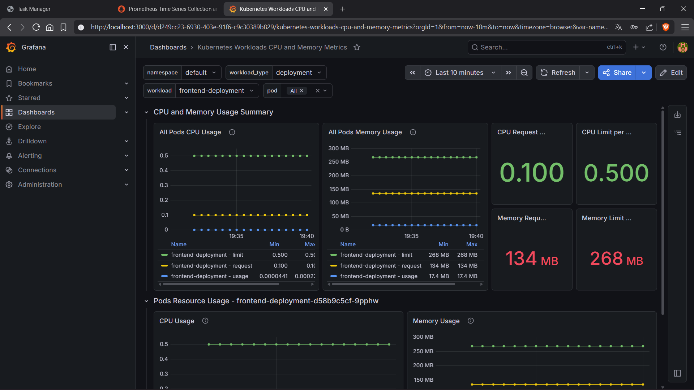
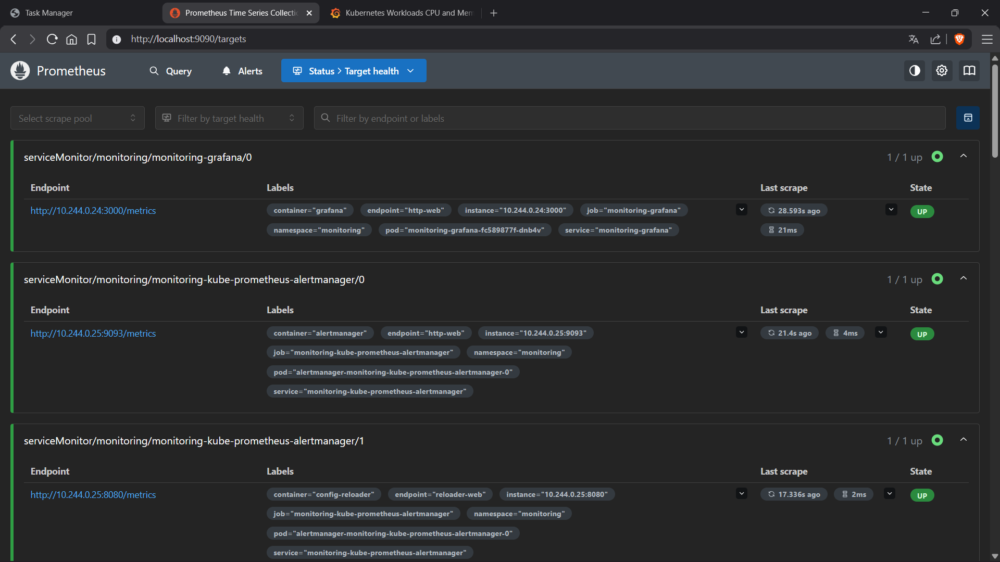
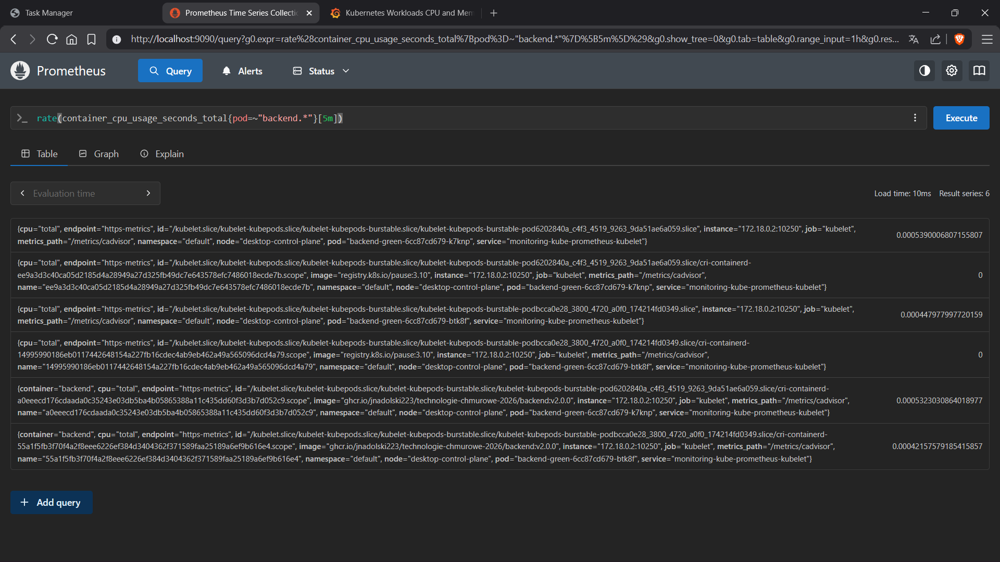

# Laboratorium 14

---

## Treść zadania
Dziś w naszym projekcie **Task manager** dodamy ostatni element produkcyjnego systemu: monitoring. Zainstalujemy Prometheusa
i Grafanę przy użyciu Helma, i skonfigurujemy dashboard, który pokaże stan naszego klastra i aplikacji.

### Krok 1 — Instalacja Helm
```shell
# MacOS
brew install helm

# Windows
winget install Helm.Helm

# Linux
curl https://raw.githubusercontent.com/helm/helm/main/scripts/get-helm-3 | bash
```
Zweryfikuj instalację:
```shell
helm version
```

### Krok 2 — Dodaj repozytorium i zainstaluj kube-prometheus-stack
Dodaj repozytorium prometheus-community i zaktualizuj listę dostępnych chartów:
```shell
helm repo add prometheus-community https://prometheus-community.github.io/helm-charts
helm repo update
```
Zainstaluj stack monitoringu w dedykowanym namespace:
```shell
kubectl create namespace monitoring

helm install monitoring prometheus-community/kube-prometheus-stack \
  --namespace monitoring \
  --set grafana.adminPassword=admin123
```
Instalacja może zająć 2–3 minuty. Obserwuj postęp:
```shell
kubectl get pods -n monitoring -w
```
Poczekaj, aż wszystkie Pody osiągną status `Running`. Sprawdź, co zostało zainstalowane:
```shell
helm list -n monitoring
kubectl get pods -n monitoring
kubectl get services -n monitoring
```

### Krok 3 — Dostęp do Grafany
Uzyskaj dostęp do interfejsu Grafany przez port-forward:
```shell
kubectl port-forward -n monitoring service/monitoring-grafana 3000:80
```
Otwórz w przeglądarce `http://localhost:3000` i zaloguj się:
- Login: `admin`
- Hasło: `admin123`

### Krok 4 — Zaimportuj dashboard
W interfejsie Grafany zaimportuj gotowy dashboard dla Kubernetes:
- Kliknij ikonę **Dashboards** w lewym menu.
- Wybierz **Import**.
- W polu **Import via grafana.com** wpisz ID dashboardu: 20372.
- Kliknij **Load**.
- W polu **Prometheus** wybierz dostępne źródło danych.
- Kliknij **Import**.

Dashboard **Kubernetes / Compute Resources / Namespace (Pods)** pokaże zużycie CPU i RAM przez każdy Pod w klastrze.

### Krok 5 — Obserwuj swój system
Wygeneruj ruch na swojej aplikacji — parę POSTów i GETów. Wróć do Grafany i obserwuj, jak metryki zmieniają się w czasie
rzeczywistym. Zwróć uwagę na:
- Zużycie CPU przez Pody backendu podczas ruchu.
- Zużycie RAM przez PostgreSQL.
- Ogólny stan węzłów klastra.

### Krok 6 — Sprawdź Prometheusa
Uzyskaj dostęp do interfejsu Prometheusa:
```shell
kubectl port-forward -n monitoring service/monitoring-kube-prometheus-prometheus 9090:9090
```
Otwórz `http://localhost:9090` i wykonaj kilka zapytań PromQL:
```shell
# Lista wszystkich Podów i ich stan
kube_pod_status_phase

# Zużycie CPU przez Pody backendu
rate(container_cpu_usage_seconds_total{pod=~"backend.*"}[5m])

# Zużycie RAM przez wszystkie Pody w namespace default
container_memory_usage_bytes{namespace="default"}
```
Przejdź do zakładki **Status > Targets** i sprawdź, jakie endpointy Prometheus monitoruje automatycznie.

### Krok 7 — Zaktualizuj strukturę repozytorium
Dodaj katalog dla konfiguracji monitoringu:
```text
k8s/
|___ monitoring/
     |___ values.yaml          <- nadpisane wartości dla helm charta
```
Utwórz plik k8s/monitoring/values.yaml z konfiguracją, której użyłeś:
```yaml
grafana:
  adminPassword: admin123
```

### W odpowiedzi należy przesłać
1. Link do repozytorium GitHub z plikiem `k8s/monitoring/values.yaml` i zaktualizowanym `README.md`.
2. Output komendy `helm list -n monitoring` potwierdzający zainstalowany release.
3. Output komendy `kubectl get pods -n monitoring` - wszystkie Pody w statusie `Running`.
4. Zrzut ekranu z dashboardu **Graphany**.

### Kryteria recenzji
- **Instalacja przez Helm (25%)**  
  Output `helm list -n monitoring` potwierdza zainstalowany release `monitoring` ze statusem `deployed`. Wszystkie Pody
  w namespace `monitoring` działają. Repozytorium zawiera plik `k8s/monitoring/values.yaml`.
- **Grafana — dashboard i dostęp do metryk (35%)**  
  Zrzut ekranu potwierdza działający dashboard pokazujący Pody z namespace `default`. Na dashboardzie widoczne są Pody
  należące do systemu Task Managera (backend, frontend, postgres). Dashboard pokazuje realne dane — nie pustą siatkę bez
  metryk.
- **Prometheus — targets (25%)**  
  Zrzut ekranu zakładki **Status > Targets** pokazuje monitorowane endpointy ze statusem `UP`. Student wykonał i przesłał
  wynik co najmniej jednego własnego zapytania PromQL dotyczącego swojego systemu.
- **Dokumentacja (15%)**  
  Plik `README.md` zawiera kompletne instrukcje instalacji monitoringu — komendy `helm repo add`, `helm install` i dostęp
  do Grafany. Instrukcje są wystarczające, żeby odtworzyć instalację od zera na czystym klastrze.

## Rozwiązanie zadania
### Wynik komendy `helm list -n monitoring` potwierdzający zainstalowany release


### Wynik komendy `kubectl get pods -n monitoring` z wszystkimi Podami w statusie `Running`


### Zrzut ekranu z dashboardu Grafany (postgres)


### Zrzut ekranu z dashboardu Grafany (backend)


### Zrzut ekranu z dashboardu Grafany (frontend)


### Zrzut ekranu z dashboardu Prometheusa (zakładka Status > Targets)


### Zrzut ekranu z dashboardu Prometheusa (własne zapytanie PromQL dotyczące systemu Task Managera)

